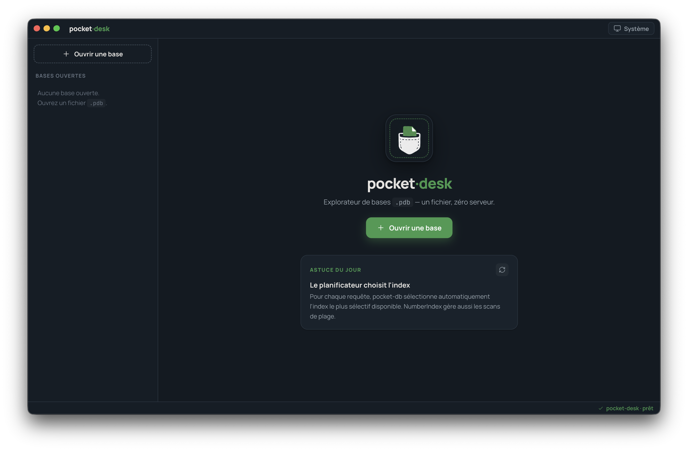
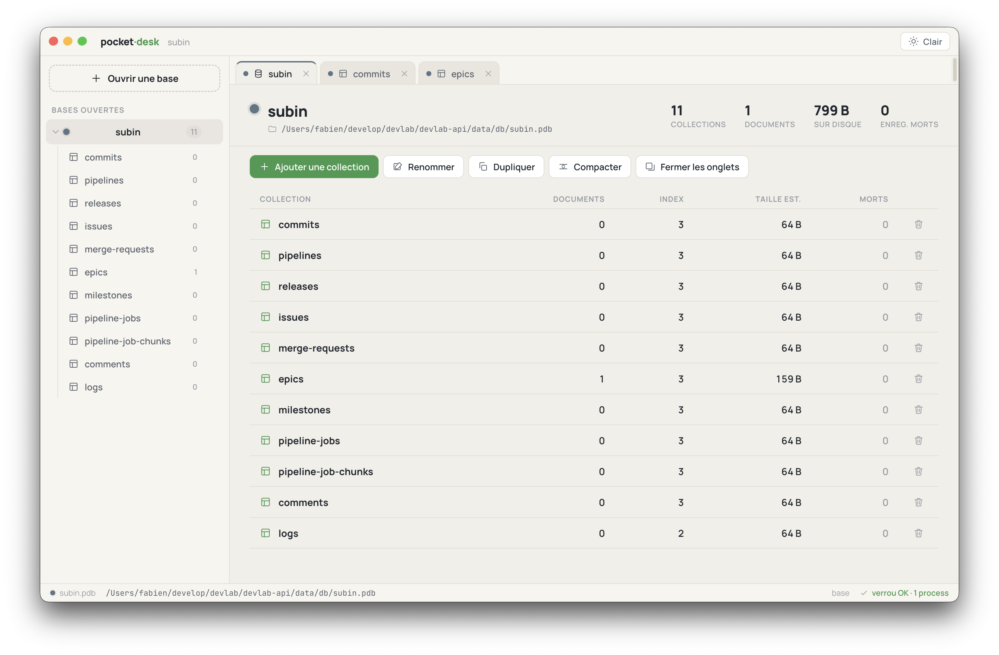
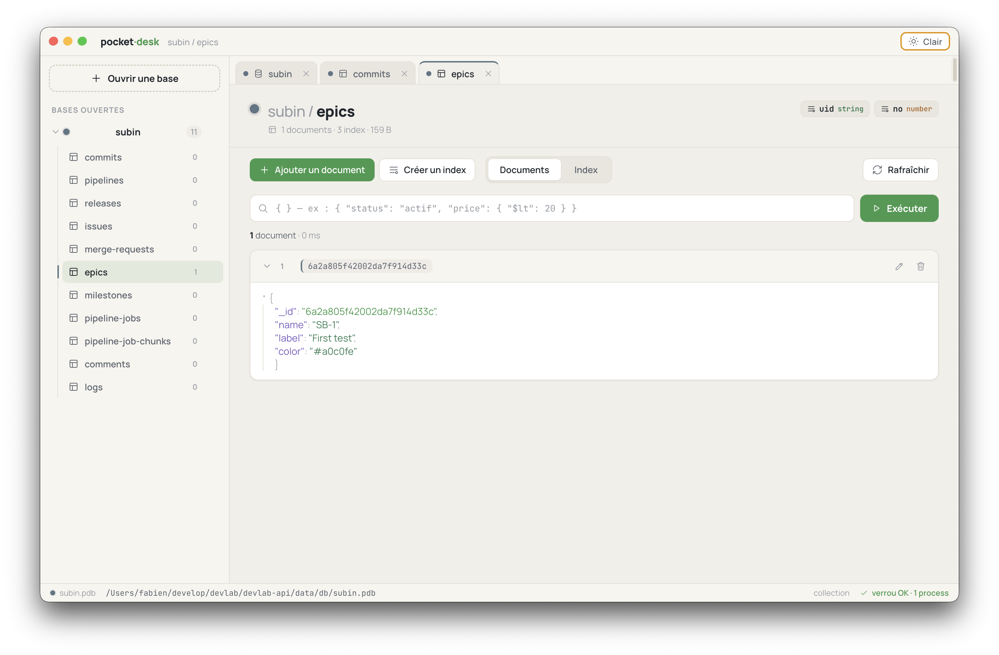

<p align="center">
  
</p>

<h1 align="center">pocket·desk</h1>

<p align="center">
  <strong>The desktop companion for <a href="https://github.com/AxFab/pocket-db">pocket-db</a>.</strong><br />
  Explore, query and edit single-file <code>.pdb</code> databases — one file, zero server.
</p>

<p align="center">
  <a href="LICENSE"></a>
  
  
</p>

> **Warning:** `pocket-desk` is a companion tool for the new `pocket-db` package. This tool is currently in beta, but it is already useful for getting started. Feedback is welcome and greatly appreciated. I'll continue to invest in improving its quality, stability, and documentation as adoption and user demand grow.

---

<p align="center">
  
</p>

Your data deserves better than `console.log(db.collection("users").find().toArray())`.

**pocket·desk** is a GUI for data exploration, heavily inspired by **MongoDB Compass** — but built for databases that fit in your pocket. Point it at any [pocket-db](https://github.com/AxFab/pocket-db) file and browse collections, run queries, inspect documents and manage indexes, without writing a single line of code.

## Why you'll like it

**Open a file, see everything.** No connection strings, no credentials, no daemon. Pick a `.pdb` file and the sidebar instantly maps every database and collection — doc counts, indexes, size on disk, dead records.

<p align="center">
  <picture>
    <source media="(prefers-color-scheme: dark)" srcset="docs/Screen_Dark_Cols.png" />
    
  </picture>
</p>

**Query like Compass.** Type a MongoDB-style filter — `{ "status": "actif", "price": { "$lt": 20 } }` — hit Enter, and the query runs in the real pocket-db engine ($eq, $ne, $gt/$gte, $lt/$lte, $in/$nin, $exists, $or, $and…), with result count and execution time.

**Edit documents safely.** Collapsible, syntax-colored JSON cards with one-click edit and delete. The editor offers a typed form mode (with field coercion and a locked `_id`) and a raw JSON mode.

<p align="center">
  
</p>

**Manage the engine, not just the data.** Create and drop secondary indexes (string / number), compact the file to reclaim dead records, duplicate a database with a real on-disk copy, and watch the `.lock` status live in the status bar — including stale locks left by crashed processes.

**Make it yours.** Light, dark or follow-the-system theme. Three density levels. Four accent colors. Color-coded tabs per database, with native drag-and-drop reordering. Everything remembered between sessions.

**Works offline, everywhere.** Fonts are self-hosted, nothing phones home. macOS, Windows and Linux.

## Getting started

pocket·desk opens databases created by [`@axfab/pocket-db`](https://www.npmjs.com/package/@axfab/pocket-db) — the embedded, append-only, single-file NoSQL database for Node.js.

```bash
git clone https://github.com/AxFab/pocket-desk.git
cd pocket-desk
npm install

# Development (Electron + Vite HMR)
npm run dev

# Production build
npm run build
```

Then click **“Ouvrir une base”**, pick a `.pdb` file, and explore.

> Don't have a `.pdb` file yet? Create one in ten seconds:
>
> ```js
> import { open } from "@axfab/pocket-db"
> const db = open({ path: "./demo.pdb" })
> db.collection("users").insertOne({ name: "Ada", age: 36 })
> db.close()
> ```

## Under the hood

| Layer | Tech |
|-------|------|
| Desktop shell | Electron |
| UI | Vue 3 (Composition API) + Pinia |
| Engine access | `@axfab/pocket-db`, isolated in the main process behind an IPC bridge |
| Design | Custom token-based design system, Manrope + JetBrains Mono |

The renderer never touches the filesystem: every read and write goes through IPC to the real pocket-db engine, and the UI re-fetches after each mutation — what you see is what's in the file.

## Roadmap

Saved query bookmarks, an index benchmark tool, and per-index statistics (size, selectivity) are on the list. Contributions and ideas are welcome — open an issue!

## License

[MIT](LICENSE) — © Fabien Bavent
